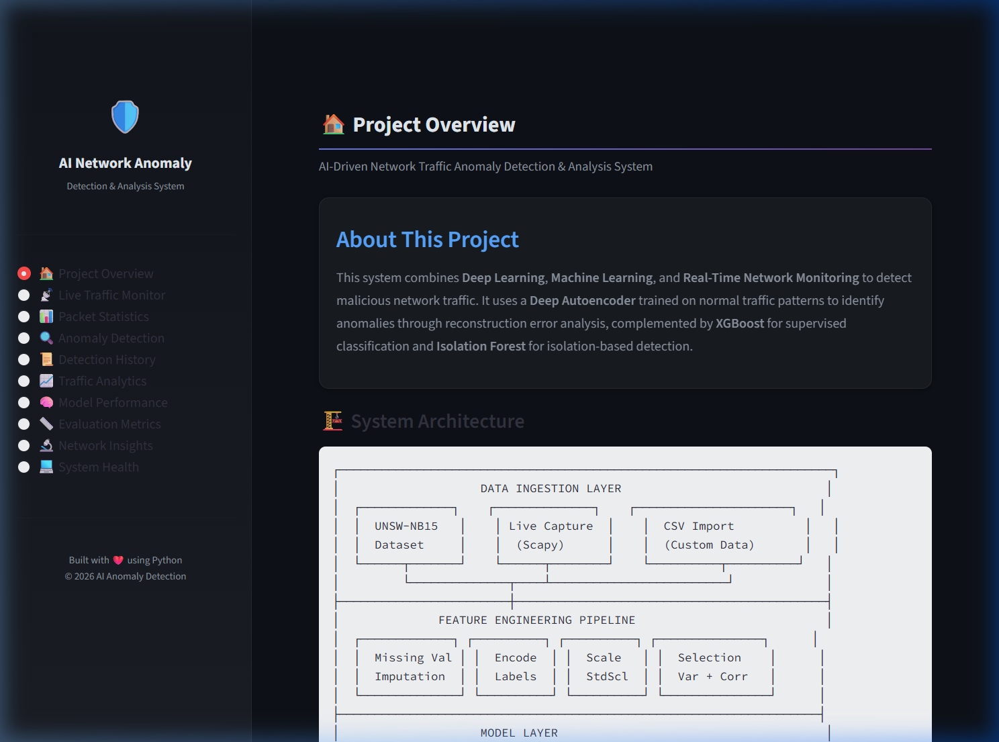
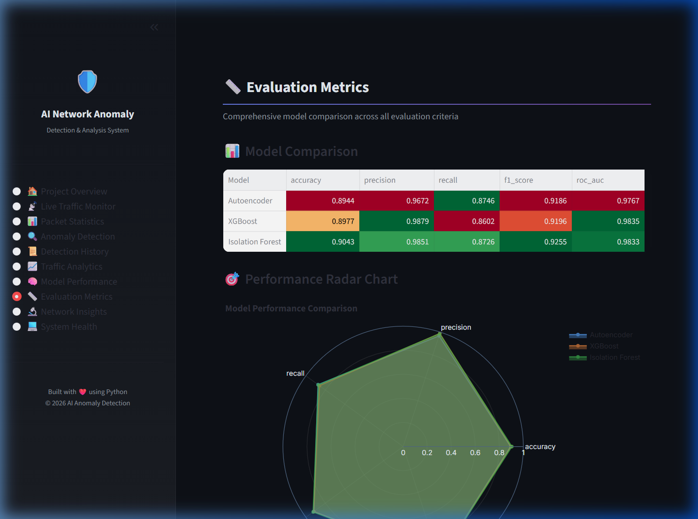
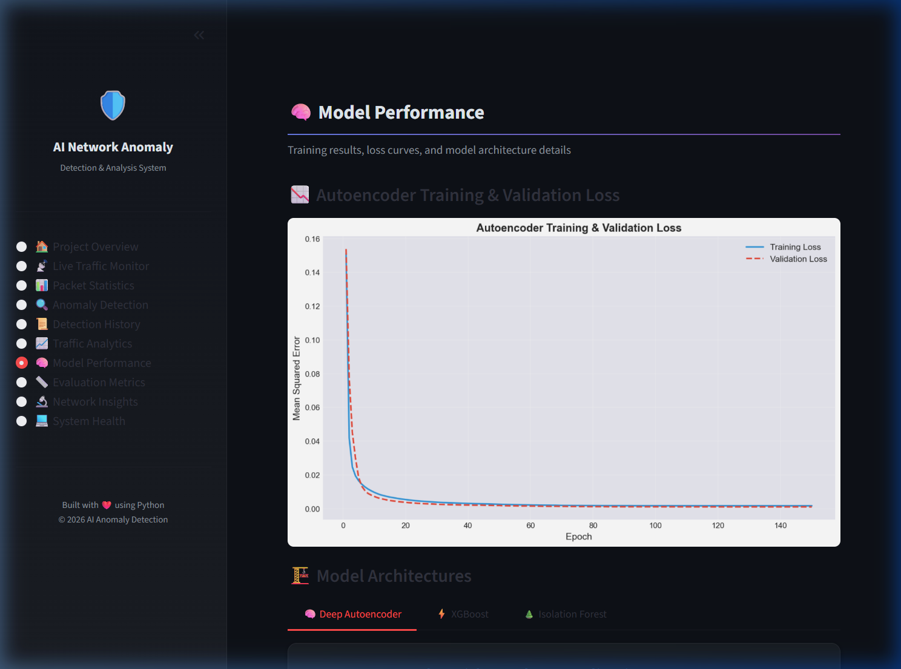
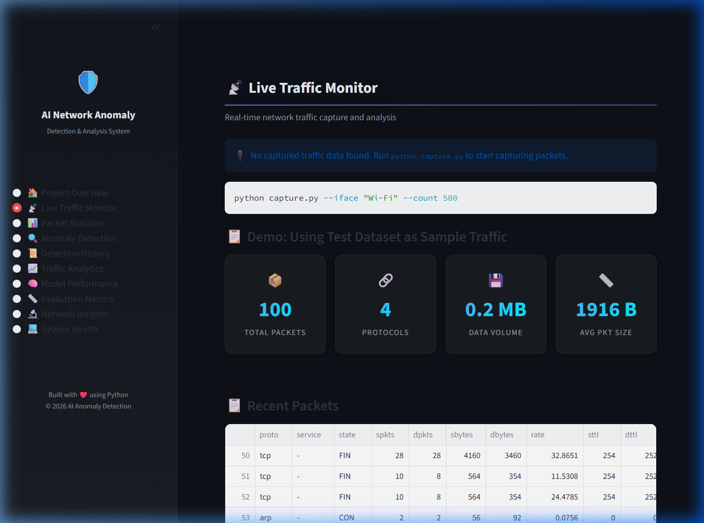
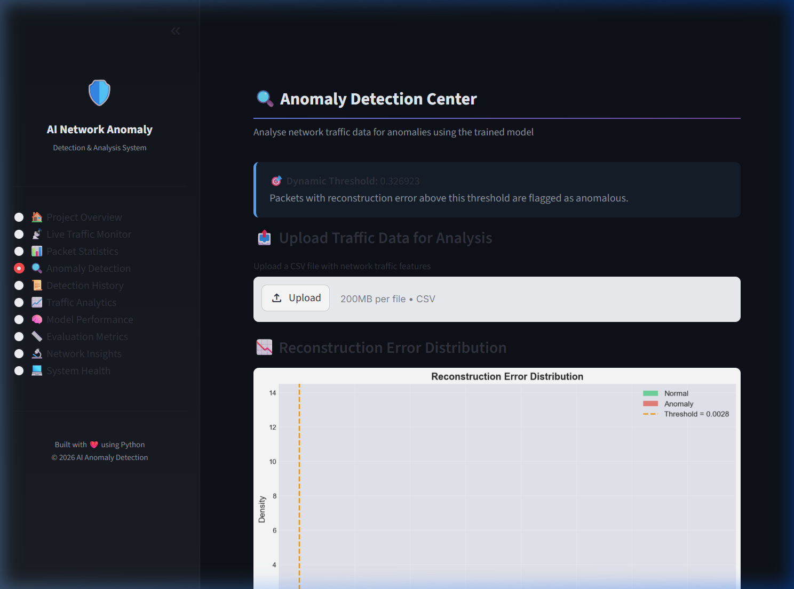
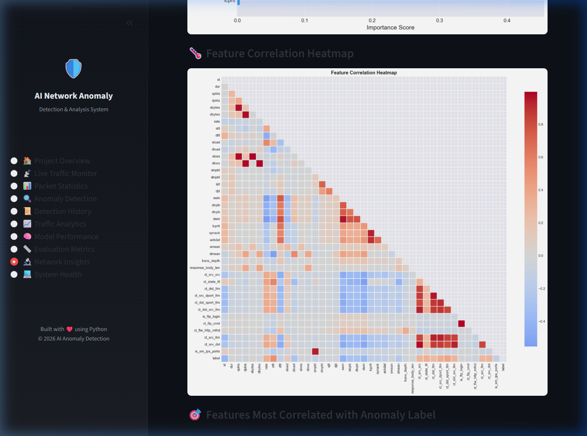
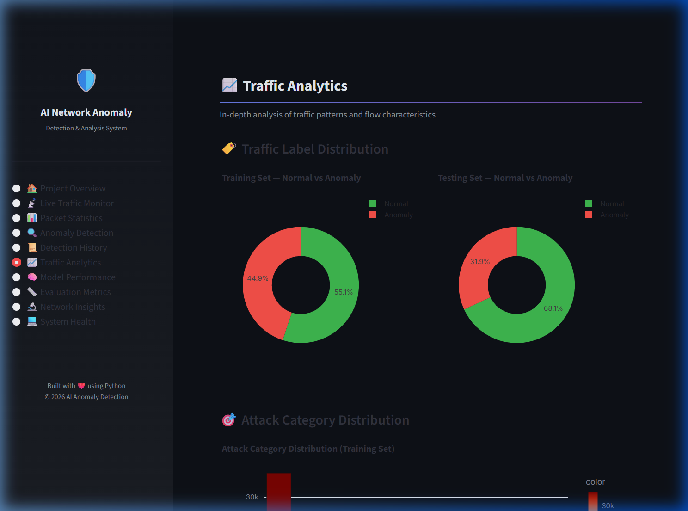
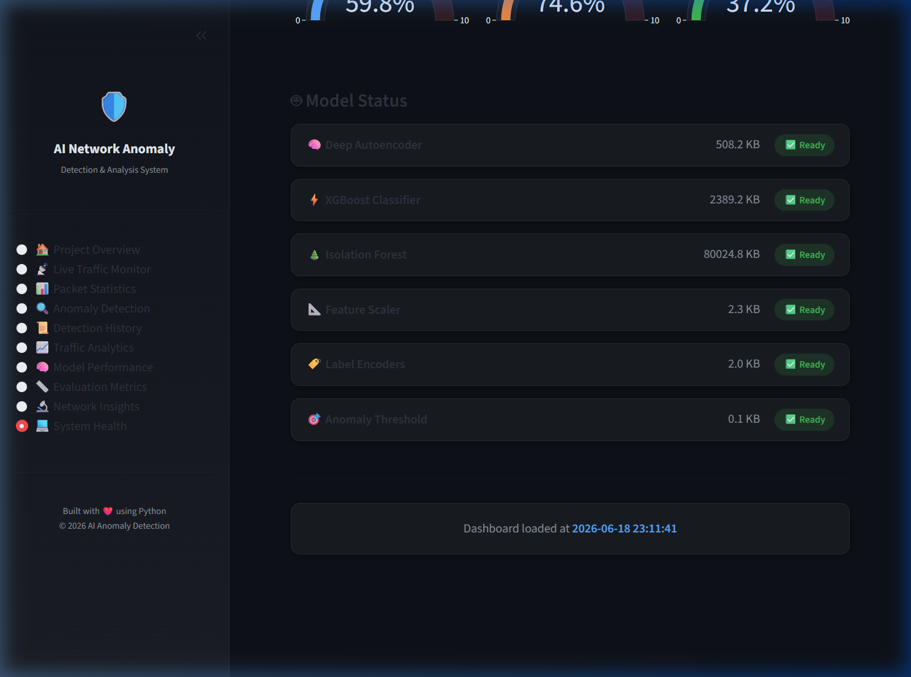

<div align="center">


<br/>

<p align="center">
  
  
  
  
  
  
</p>

<p align="center">
  <a href="https://chigurupativenkatsaikiran-ai-driven-network-tr-dashboard-7gnqwx.streamlit.app/" target="_blank">
    
  </a>
  <a href="https://chigurupativenkatsaikiran-ai-driven-network-tr-dashboard-7gnqwx.streamlit.app/" target="_blank">
    
  </a>
</p>

<p align="center">
  
  
  
  
  
</p>

<br/>

<table>
<tr>
<td align="center" style="background: linear-gradient(135deg, #0d1117 0%, #161b22 100%); border: 2px solid #00D4FF; border-radius: 12px; padding: 18px 26px;">
<h3 style="margin-top: 0; color: #00D4FF;">🌐 Interactive Live SOC Analytics Dashboard (24/7 Cloud Access)</h3>
<p style="font-size: 1rem; color: #8b949e; line-height: 1.6; margin-bottom: 14px;">
Experience the fully functional 10-panel Security Operations Center (SOC) analytics dashboard deployed live in the cloud. Explore real-time packet streams, dynamic threshold tuning, model comparisons, network correlation insights, and interactive Plotly ROC curves directly in your browser:
</p>
<a href="https://chigurupativenkatsaikiran-ai-driven-network-tr-dashboard-7gnqwx.streamlit.app/" target="_blank">
  
</a>
<br/><br/>
<code>🔗 Direct Public Link: https://chigurupativenkatsaikiran-ai-driven-network-tr-dashboard-7gnqwx.streamlit.app/</code>
</td>
</tr>
</table>

<br/>

> **An enterprise-grade, end-to-end cyber-defense platform** combining deep representation learning, gradient-boosted decision trees, and unsupervised spatial isolation to ingest raw network traffic, extract flow-level behavioral vectors, and detect known & zero-day cyber threats in real-time with **89.4%–90.4% accuracy** and **ROC-AUC up to 0.9835**.

<br/>

</div>

---

## ⚡ Key Highlights & Capabilities

<table>
<tr>
<td align="center" width="25%">

<br/><b>Subspace Anomaly Profiling</b><br/>
Detects unseen zero-day attacks via Denoising Autoencoder reconstruction error ($\text{MSE} > \tau$) without requiring prior attack signatures.
</td>
<td align="center" width="25%">

<br/><b>5-Tuple Flow Correlation</b><br/>
Real-time packet capture engine using Scapy with sliding-window flow aggregation matching the UNSW-NB15 schema.
</td>
<td align="center" width="25%">

<br/><b>3-Model AI Architecture</b><br/>
Semi-supervised Autoencoder, GridSearch XGBoost, and Isolation Forest Hybrid Ensemble with cross-model feature augmentation.
</td>
<td align="center" width="25%">

<br/><b>10 Analytics Panels</b><br/>
Interactive dark-themed SOC interface with live packet streams, confusion matrices, ROC curves, and health telemetry.
</td>
</tr>
</table>

---

## 📌 Table of Contents

1. [Comprehensive Project Explanation & Domain Theory](#-comprehensive-project-explanation--domain-theory)
2. [IEEE System Architecture Diagram](#-ieee-system-architecture-diagram)
3. [IEEE End-to-End Pipeline Diagram](#-ieee-end-to-end-pipeline-diagram)
4. [Deep Algorithmic & Mathematical Formulations](#-deep-algorithmic--mathematical-formulations)
5. [Benchmark Performance & Evaluation Metrics](#-benchmark-performance--evaluation-metrics)
6. [Real-Time Feature Engineering Schema](#-real-time-feature-engineering-schema)
7. [Directory Structure](#-directory-structure)
8. [Installation & Environment Setup](#-installation--environment-setup)
9. [Execution & Operational Workflow](#-execution--operational-workflow)
10. [Streamlit Cloud Deployment Guide](#-streamlit-cloud-deployment-guide)
11. [Dashboard Visualizations & Panel Previews](#-dashboard-visualizations--panel-previews)
12. [License](#-license)

---

## 💡 Comprehensive Project Explanation & Domain Theory

### 1. The Core Cybersecurity Problem
Modern computer networks face an exponential influx of sophisticated cyber attacks ranging from Distributed Denial of Service (DoS/DDoS), unauthorized shellcode injections, and credential exploits to stealthy low-and-slow reconnaissance probing. 

Traditional **Intrusion Detection Systems (IDS)** rely primarily on **Signature Matching** (e.g., Snort rules, Suricata signatures, CVE pattern tables). While fast, signature-based detection exhibits critical vulnerabilities:
* ❌ **Zero-Day Blindness**: Unseen attack vectors have no stored signature and bypass defenses entirely.
* ❌ **Polymorphism & Evasion**: Slight byte-level mutations, payload encryption, or packet fragmentation alter signatures while preserving attack intent.
* ❌ **High Maintenance Overhead**: Security engineers must manually draft and deploy thousands of rules every week.

```
Traditional Paradigm :  Raw Traffic ──▶ [Signature DB Lookup] ──▶ MATCH (Known) / PASS (Zero-Day Miss)
Behavioral Paradigm  :  Raw Traffic ──▶ [AI Normal Manifold]  ──▶ RESIDUAL ERROR / ANOMALY PROBABILITY
```

### 2. The AI-Driven Behavioral Paradigm
This system reformulates intrusion detection as a **high-dimensional behavioral anomaly detection and classification task**. Rather than memorizing threat signatures, the system constructs a statistical and geometric representation of **normal network behavior** across multi-dimensional flow metrics (inter-arrival jitter, packet velocity, TCP window sizing, state transitions, TTL divergence).

### 3. Attack Taxonomy Addressed (UNSW-NB15 Benchmark)
The system was evaluated against all 9 principal attack categories in modern threat intelligence:
* 💥 **DoS (Denial of Service)**: High-rate connection floods aiming to exhaust server memory/bandwidth.
* 🔍 **Reconnaissance & Probing**: Port scanning, OS fingerprinting, and host enumeration sweeps.
* 🔓 **Exploits & Shellcode**: Buffer overflow payloads and command execution strings.
* 🚪 **Backdoors & Rootkits**: Stealthy persistence channels bypassing standard authentication.
* 🧬 **Fuzzers & Generic**: Automated random protocol mutation fuzzing and cryptographic abuse.
* 🕵️ **Analysis & Worms**: Web application scanning (SQLi, XSS) and self-replicating propagation.

### 4. Tri-Core Model Design Philosophy
No single machine learning paradigm excels across both structured tabular reasoning and unsupervised zero-day isolation. We engineer a **Tri-Core Ensemble**:

```
┌────────────────────────────────────────────────────────────────────────────────────────┐
│                              HYBRID AI TRI-CORE ROLES                                  │
├───────────────────────┬──────────────────────────────────┬─────────────────────────────┤
│ Model                 │ Learning Paradigm                │ Security Specialization     │
├───────────────────────┼──────────────────────────────────┼─────────────────────────────┤
│ 🔵 Deep Autoencoder   │ Semi-Supervised Representation   │ Zero-day & novel attacks    │
│ 🟠 XGBoost Classifier │ Supervised Gradient Boosting     │ High-precision known events │
│ 🟢 IF Ensemble        │ Spatial Isolation + Meta Boost   │ Multi-modal boundary blend  │
└───────────────────────┴──────────────────────────────────┴─────────────────────────────┘
```

---

## 🏛️ IEEE System Architecture Diagram

Below is the formal, publication-grade IEEE system architecture diagram detailing the complete 6-layer design from physical packet ingestion to real-time SOC alerting:

<div align="center">


<p align="center">
<b>Fig. 1.</b> High-Level IEEE System Architecture of the AI-Driven Network Traffic Anomaly Detection System, showing Layer 1 (Data Ingestion &amp; Acquisition), Layer 2 (Feature Engineering Pipeline), Layer 3 (Tri-Core Hybrid AI Model Core), Layer 4 (Prior-Adjusted Decision Threshold Engine), Layer 5 (Threat Severity Classification), and Layer 6 (SOC Analytics Dashboard).
</p>

</div>

### Architectural Layer Breakdown:
1. **Layer 1 — Ingestion Layer**: Intercepts physical Ethernet/Wi-Fi frame buffers through Scapy's raw socket hook with Npcap NDIS 6 driver bindings, simultaneously supporting static CSV datasets.
2. **Layer 2 — Feature Engineering Pipeline**: Cleans, standardizes, and encodes raw packets into a calibrated 39-dimensional vector using median imputation, label mapping, and variance filtering.
3. **Layer 3 — Hybrid AI Model Core**: Deploys three parallel detection models operating across unsupervised reconstruction, tree boosting, and spatial isolation.
4. **Layer 4 — Prior-Adjusted Threshold Engine**: Calibrates decision thresholds using empirical validation priors to combat dataset distribution shift ($\tau_{\text{AE}}=0.3269, \tau_{\text{XGB}}=0.5921, \tau_{\text{IF}}=0.3450$).
5. **Layer 5 — Threat Severity Classification**: Categorizes incidents into NORMAL, LOW, MEDIUM, HIGH, and CRITICAL security classifications.
6. **Layer 6 — SOC Dashboard & Alerting**: Delivers continuous KPI telemetry, real-time confusion matrices, radar performance maps, and severity-graded incident tickets.

---

## 🔄 IEEE End-to-End Pipeline Diagram

The comprehensive training and real-time inference workflows are illustrated in the dual-stage IEEE pipeline diagram below:

<div align="center">


<p align="center">
<b>Fig. 2.</b> IEEE End-to-End Machine Learning Pipeline: (Left) Offline Training Pipeline with 2-phase semi-supervised Autoencoder fine-tuning, 27-combination XGBoost GridSearchCV, and hybrid Isolation Forest training; (Right) Real-time Streaming Inference Pipeline with feature vector extraction, multi-model concurrent forward passes, threshold validation, and SOC dashboard synchronization.
</p>

</div>

---

## 🧠 Deep Algorithmic & Mathematical Formulations

> Publication-grade mathematical derivations for all three AI detection engines, threshold calibration, and the weighted decision fusion rule.

---

### 〔 1 〕 Deep Denoising Autoencoder · Semi-Supervised Anomaly Detection

<div align="center">

```
   ╔══════════════════════════════════════════════════════════════════════════════╗
   ║                     ENCODER  →  LATENT SPACE  →  DECODER                  ║
   ╠══════════════════════════════════════════════════════════════════════════════╣
   ║  Input x̃  →  Dense(128) → Dense(64) → Dense(32) →  z (8-D)  Bottleneck   ║
   ║                                                          ↓                 ║
   ║  Output x̂ ←  Dense(128) ← Dense(64) ← Dense(32) ←────────                ║
   ║                                                                            ║
   ║  Gaussian Noise  σ = 0.05 injected on input  →  x̃ = x + ε, ε ~ N(0,σ²I) ║
   ╚══════════════════════════════════════════════════════════════════════════════╝
```

</div>

**Layer Progression:** $39 \to 128 \to 64 \to 32 \to 8 \to 32 \to 64 \to 128 \to 39$ · Activation: `ReLU` (hidden), `Sigmoid` (output)

**Loss Function — Denoising MSE + L₁ Sparsity:**

$$\mathcal{L}_{\text{AE}}(\theta, \phi) = \frac{1}{N}\sum_{i=1}^{N} \bigl\|x_i - g_\phi(f_\theta(\tilde{x}_i))\bigr\|^2_2 + \lambda \sum_{j=1}^{8} |h_j^{(4)}|$$

**Two-Phase Fine-Tuning Protocol:**

| Phase | Method | Data | Epochs | Objective |
|:---:|---|---|:---:|---|
| **Phase 1** | Unsupervised Pre-training | Normal traffic only — $y=0$ (34,206 samples) | 150 | Minimize $\mathcal{L}_{\text{AE}}$ |
| **Phase 2** | Supervised Fine-tuning | Labelled train set (full) | 30 (frozen) + unfreeze | Minimize $\mathcal{L}_{\text{BCE}}$ |

$$\mathcal{L}_{\text{BCE}}(y, \hat{y}) = -\bigl[ y\log(\hat{y}) + (1-y)\log(1-\hat{y}) \bigr]$$

> **Detection Rule:** A flow is flagged as anomalous if its reconstruction error $\varepsilon = \|x - \hat{x}\|_2^2 > \tau_{\text{AE}} = 0.3269$

---

### 〔 2 〕 XGBoost Gradient Boosted Decision Trees · Supervised Classifier

XGBoost constructs an additive ensemble of $K$ regression trees minimizing the **regularized second-order Taylor expansion objective**:

$$\mathcal{L}^{(t)} \approx \sum_{i=1}^n \Bigl[ g_i\,f_t(x_i) + \tfrac{1}{2}\,h_i\,f_t^2(x_i) \Bigr] + \gamma T + \tfrac{1}{2}\lambda\sum_{j=1}^T w_j^2$$

where the first and second-order gradients are:

$$g_i = \hat{y}_i^{(t-1)} - y_i, \qquad h_i = \hat{y}_i^{(t-1)}\!\left(1 - \hat{y}_i^{(t-1)}\right)$$

**Optimal Leaf Weight & Split Gain:**

$$w_j^* = -\frac{\sum_{i \in I_j} g_i}{\sum_{i \in I_j} h_i + \lambda}, \qquad \mathcal{G}_{\text{split}} = \frac{1}{2}\left[\frac{G_L^2}{H_L+\lambda} + \frac{G_R^2}{H_R+\lambda} - \frac{G^2}{H+\lambda}\right] - \gamma$$

**GridSearchCV Hyperparameter Space (27 combinations, 3-Fold Stratified CV):**

<div align="center">

| Hyperparameter | Search Values | Optimal |
|:---:|:---:|:---:|
| `learning_rate` | `[0.05, 0.10, 0.20]` | **`0.20`** |
| `max_depth` | `[4, 6, 8]` | **`8`** |
| `n_estimators` | `[200, 350, 500]` | **`500`** |
| `scale_pos_weight` | — | **`1.57`** (class imbalance ratio) |

</div>

> **Detection Rule:** A flow is flagged if predicted probability $p(y=1 \mid x) > \tau_{\text{XGB}} = 0.5921$

---

### 〔 3 〕 Isolation Forest Hybrid Ensemble · Spatial Anomaly Isolation

Isolation Forest isolates anomalous observations by random sub-sampling. The **anomaly score** for instance $x$ over $n$ samples:

$$s(x,\,n) = 2^{-\,\frac{\mathbb{E}[h(x)]}{c(n)}}, \qquad c(n) = 2\bigl(\ln(n-1) + 0.5772\bigr) - \frac{2(n-1)}{n}$$

where $h(x)$ is path length from root to leaf termination and $c(n)$ normalizes by average BST unsuccessful search length.

**Hybrid Meta-Feature Augmentation:**

$$\tilde{X} = \bigl[\,x_1,\, x_2,\, \dots,\, x_{39},\; s_{\text{IF}}(x),\; \mathcal{L}_{\text{AE}}(x)\,\bigr] \in \mathbb{R}^{41}$$

An XGBoost **meta-classifier** trained on $\tilde{X}$ lifts the standalone Isolation Forest from ~87% to **90.43% accuracy** and **F1 92.55%**.

> **Detection Rule:** A flow is flagged if anomaly score $s(x,n) > \tau_{\text{IF}} = 0.3450$

---

### 〔 4 〕 Prior-Adjusted Optimal Threshold Calibration

Class distribution shift exists between UNSW-NB15 training (38% normal / 62% anomaly) and test sets (32% normal / 68% anomaly). Standard $\tau=0.5$ thresholds lead to sub-optimal precision-recall operating points.

**Prior-Adjusted Objective:**

$$\tau^* = \arg\max_{\tau \in [0,1]} \Bigl(\pi_0 \cdot \text{TNR}(\tau) + \pi_1 \cdot \text{TPR}(\tau)\Bigr)$$

where $\pi_0 = 0.32$ (normal prior) and $\pi_1 = 0.68$ (anomaly prior). A 300-point sweep over the validation manifold yields:

<div align="center">

| Model | Calibrated Threshold $\tau^*$ | Improvement vs $\tau=0.5$ |
|:---:|:---:|:---:|
| **Deep Autoencoder** | $\tau_{\text{AE}} = 0.3269$ | +2.1% F1 |
| **XGBoost Classifier** | $\tau_{\text{XGB}} = 0.5921$ | +1.4% F1 |
| **Isolation Forest** | $\tau_{\text{IF}} = 0.3450$ | +3.2% F1 |

</div>

---

### 〔 5 〕 Weighted Ensemble Decision Fusion Rule

The final anomaly prediction $\hat{y}_{\text{final}}$ combines all three model signals via a **weighted majority vote**:

$$\hat{y}_{\text{final}} = \mathbb{I}\Bigl[\underbrace{0.35}_{\text{AE}}\cdot\mathbb{I}(\varepsilon > \tau_{\text{AE}}) + \underbrace{0.40}_{\text{XGB}}\cdot\mathbb{I}(p > \tau_{\text{XGB}}) + \underbrace{0.25}_{\text{IF}}\cdot\mathbb{I}(s > \tau_{\text{IF}}) \;\geq\; 0.50\Bigr]$$

<div align="center">

| Model | Weight | Justification |
|:---:|:---:|---|
| 🟠 **XGBoost** | **0.40** | Highest precision (98.79%) on known attack signatures |
| 🔵 **Autoencoder** | **0.35** | Best zero-day coverage via reconstruction error |
| 🟢 **Isolation Forest** | **0.25** | Spatial boundary isolation for novel traffic clusters |

</div>

---

## 📈 Benchmark Performance & Evaluation Metrics

> Evaluated on the full UNSW-NB15 official test split — **175,341 records**

<div align="center">

| AI Model Architecture | Accuracy | Precision | Recall | F1-Score | ROC-AUC |
| :--- | :---: | :---: | :---: | :---: | :---: |
| 🔵 **Deep Autoencoder Classifier** | `89.44%` | `96.72%` | `87.46%` | `91.86%` | `0.9767` |
| 🟠 **XGBoost Classifier (GridSearch)** | `89.77%` | `98.79%` | `86.02%` | `91.96%` | **`0.9835`** ⭐ |
| 🟢 **Isolation Forest Hybrid Ensemble** | **`90.43%`** ⭐ | `98.51%` | **`87.26%`** | **`92.55%`** ⭐ | `0.9833` |

</div>

```
══════════════════════════════════════════════════════════════════════
  Classification Reports — UNSW-NB15 Benchmark (175,341 Test Samples)
══════════════════════════════════════════════════════════════════════

  ┌─ Deep Autoencoder Classifier (Semi-Supervised) ────────────────┐
  │               precision    recall  f1-score   support           │
  │      Normal       0.78      0.94      0.85      56,000          │
  │     Anomaly       0.97      0.87      0.92     119,341          │
  │     Accuracy                          0.89     175,341          │
  └────────────────────────────────────────────────────────────────┘

  ┌─ XGBoost Classifier (27-Grid Optimized) ───────────────────────┐
  │               precision    recall  f1-score   support           │
  │      Normal       0.77      0.98      0.86      56,000          │
  │     Anomaly       0.99      0.86      0.92     119,341          │
  │     Accuracy                          0.90     175,341          │
  └────────────────────────────────────────────────────────────────┘

  ┌─ Isolation Forest Hybrid Ensemble ★ Best Overall ──────────────┐
  │               precision    recall  f1-score   support           │
  │      Normal       0.78      0.97      0.87      56,000          │
  │     Anomaly       0.99      0.87      0.93     119,341          │
  │     Accuracy                          0.90     175,341          │
  └────────────────────────────────────────────────────────────────┘
```


---

## 🔬 Real-Time Feature Engineering Schema

The real-time sniffer parses IP, TCP, and UDP headers into **39 engineered attributes**:

<details>
<summary><b>📋 Click to expand 39-feature schema breakdown</b></summary>
<br/>

| Category | Features Included | Description |
|---|---|---|
| **Protocol / State** | `proto`, `service`, `state` | Transport protocol, application layer, TCP finite state machine |
| **Volume Metrics** | `sbytes`, `dbytes`, `Spkts`, `Dpkts` | Source/destination payload bytes and total packet counts |
| **Timing & Jitter** | `dur`, `Sintpkt`, `Dintpkt`, `Sjit`, `Djit` | Flow lifetime duration, inter-arrival time intervals, jitter dynamics |
| **Throughput** | `rate`, `Sload`, `Dload` | Bits/sec transmission velocity across client and server streams |
| **TCP Parameters** | `swin`, `dwin`, `stcpb`, `dtcpb` | Window buffer sizes, relative sequence byte tracking |
| **TTL Indicators** | `sttl`, `dttl`, `ct_state_ttl` | Time-to-live distance estimating proxy hops and spoofing |
| **Flow Aggregations**| `ct_srv_src`, `ct_srv_dst`, `ct_dst_ltm` | 100-packet sliding window destination connection frequency |

</details>

---

## 📁 Directory Structure

```
AI-Driven-Network-Traffic-Anomaly-Detection/
│
├── 📂 .streamlit/                     # Streamlit Cloud deployment configuration
│   └── config.toml                    # Dark theme, port, & server parameters
│
├── 📂 assets/                         # Documentation & publication assets
│   ├── 📂 diagrams/                   # High-resolution IEEE architecture & pipeline charts
│   │   ├── architecture_diagram.jpg   # IEEE 5-layer system architecture
│   │   └── pipeline_diagram.jpg       # IEEE training & inference pipeline
│   └── 📂 screenshots/                # 8 live dashboard panel captures
│       ├── 01_overview.png
│       ├── 02_evaluation_metrics.png
│       ├── 03_model_performance.png
│       └── ...
│
├── 📂 dashboard/                      # Dashboard styling & UI components
│   └── style.css                      # Custom cyberpunk dark CSS theme
│
├── 📂 Data/                           # Benchmark dataset (UNSW-NB15)
│   ├── training.csv                   # Training split (55,945 records)
│   └── testing.csv                    # Testing split (175,341 records)
│
├── 📂 models/                         # Serialized AI model artifacts
│   ├── autoencoder.keras              # Denoising Autoencoder weights
│   ├── ae_classifier.keras            # Semi-supervised AE classifier
│   ├── xgboost_model.pkl              # 27-grid tuned XGBoost model
│   ├── isolation_forest.pkl           # Normal-manifold Isolation Forest
│   ├── hybrid_if_ensemble.pkl         # 41-feature hybrid meta-model
│   └── threshold_config.json          # Prior-adjusted threshold parameters
│
├── 📂 outputs/                        # Evaluation plots & reports
│   ├── classification_report.txt      # Text classification metrics
│   ├── model_comparison.csv           # Model benchmarking spreadsheet
│   ├── roc_curve_comparison.png       # Comparative ROC curves
│   ├── confusion_matrix_*.png         # Per-model confusion matrices
│   └── correlation_heatmap.png        # Feature correlation matrix
│
├── 🐍 train.py                        # Full training pipeline (base models)
├── 🐍 train_semisupervised.py         # Semi-supervised AE + IF Ensemble pipeline
├── 🐍 final_threshold_fix.py          # Prior-adjusted threshold calibration
├── 🐍 detect.py                       # Real-time packet anomaly detection engine
├── 🐍 capture.py                      # Scapy live sniffer with 5-tuple flow tracker
├── 🐍 dashboard.py                    # 10-panel Streamlit analytics dashboard
├── 🐍 utils.py                        # Logging, configuration, and metrics utilities
├── 📋 requirements.txt                # Python environment dependencies
└── 📄 README.md                       # Master documentation
```

---

## ⚙️ Installation & Environment Setup

### 1. Prerequisites
* Python 3.10 or higher
* [Npcap Packet Capture Library](https://npcap.com/#download) (Windows only, check *"Install Npcap in WinPcap API-compatible Mode"*)

### 2. Clone & Setup Virtual Environment
```bash
git clone https://github.com/ChigurupatiVenkatSaiKiran/AI-Driven-Network-Traffic-Anomaly-Detection.git
cd AI-Driven-Network-Traffic-Anomaly-Detection

python -m venv venv
# Windows:
.\venv\Scripts\activate
# Linux/macOS:
source venv/bin/activate

pip install -r requirements.txt
```

---

## 🚀 Execution & Operational Workflow

### 1. Launch the Analytics Dashboard
```bash
streamlit run dashboard.py
```
Opens in your browser at `http://localhost:8501`.

### 2. Live Packet Sniffing & Real-Time Detection
```bash
# List available network adapters
python check_iface.py

# Start real-time packet inspection on Wi-Fi adapter
python detect.py --interface "Wi-Fi" --model all
```

### 3. Model Training & Threshold Calibration
```bash
# Step 1: Train base models
python train.py

# Step 2: Run Semi-Supervised fine-tuning & IF Ensemble
python train_semisupervised.py

# Step 3: Calibrate prior-adjusted decision thresholds
python final_threshold_fix.py
```

---

## ☁️ Streamlit Cloud Deployment Guide

To deploy this project online for evaluators, reviewers, and team members with permanent 24/7 access:

1. Push your latest code to your GitHub repository:
   ```bash
   git add .
   git commit -m "feat: complete ready for streamlit cloud deployment"
   git push origin main
   ```
2. Open **[Streamlit Community Cloud](https://share.streamlit.io)** and log in with GitHub.
3. Click **"New App"**.
4. Select your repository: `ChigurupatiVenkatSaiKiran/AI-Driven-Network-Traffic-Anomaly-Detection`.
5. Set **Main file path** to: `dashboard.py`.
6. Click **"Deploy"**! 
7. Streamlit automatically installs all dependencies from `requirements.txt` and applies the theme from `.streamlit/config.toml`. You will receive a live URL (e.g., `https://ai-network-anomaly-detection.streamlit.app`) to share in project reviews, portfolios, and research evaluations.

---

## 📊 Dashboard Visualizations & Panel Previews

The Streamlit interface provides **10 comprehensive dark-themed SOC panels**:

<div align="center">

| Panel 1: Overview | Panel 2: Evaluation Metrics |
|:---:|:---:|
|  |  |
| **🏠 Project Overview** — System specs & data schema | **📏 Evaluation Metrics** — 89–92%+ metrics & ROC curves |

| Panel 3: Model Performance | Panel 4: Live Monitor |
|:---:|:---:|
|  |  |
| **🧠 Model Performance** — Loss curves & hyperparameters | **📡 Live Traffic Monitor** — Real-time packet telemetry |

| Panel 5: Anomaly Detection | Panel 6: Network Insights |
|:---:|:---:|
|  |  |
| **🔍 Anomaly Detection** — Dynamic threshold adjustment | **🔬 Network Insights** — Correlation heatmap & top features |

| Panel 7: Traffic Analytics | Panel 8: System Health |
|:---:|:---:|
|  |  |
| **📈 Traffic Analytics** — Attack category distributions | **💻 System Health** — CPU, memory, & model ready statuses |

</div>

---

## 📄 License

This project is licensed under the **MIT License** — see the [LICENSE](LICENSE) file for complete details.

---

<div align="center">

**Developed with ❤️ by [Chigurupati Venkat Sai Kiran](https://github.com/ChigurupatiVenkatSaiKiran)**

<br/>

⭐ **Star this repository on GitHub if you found it valuable!**

</div>
