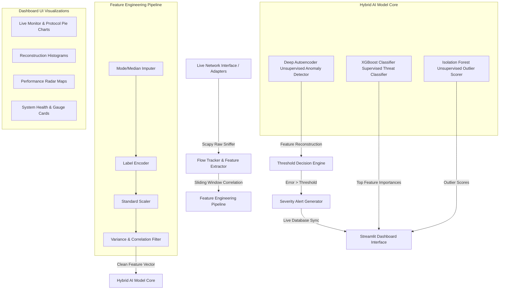

# 🛡️ AI-Driven Network Traffic Anomaly Detection & Analysis System

<p align="center">
  
  
  
  
  
  
</p>

An industry-grade, end-to-end cyber-defense solution that integrates computer networks, machine learning, and deep learning to capture, inspect, and analyze network packets in real-time. The system detects anomalous patterns (such as intrusion attempts, DoS attacks, and network probing) using hybrid machine learning architectures and displays insights through a visually stunning Streamlit analytics dashboard.

---

## 📌 Table of Contents
1. [Project Overview & Motivation](#-project-overview--motivation)
2. [End-to-End System Architecture](#-end-to-end-system-architecture)
3. [Deep Mathematical & Algorithmic Formulations](#-deep-mathematical--algorithmic-formulations)
4. [Real-Time Sniffing Feature Schema](#-real-time-sniffing-feature-schema)
5. [Project Directory Map](#-project-directory-map)
6. [Installation & Npcap Configuration](#-installation--npcap-configuration)
7. [Usage Guide & CLI Reference](#-usage-guide--cli-reference)
8. [Comparative Performance & Results](#-comparative-performance--results)
9. [Academic Viva & Presentation Q&A](#-academic-viva--presentation-qa)
10. [License](#-license)

---

## 💡 Project Overview & Motivation

Traditional **Intrusion Detection Systems (IDS)** rely on signature matching (e.g., Snort rules) to detect threats. While highly effective for known signatures, signature-based IDS fail entirely against **Zero-Day Attacks** or mutated threat variants. 

This project implements an **AI-Driven Anomaly Detection System** that shifts the focus from signature verification to **behavioral profiling**. By utilizing a hybrid model core, the system learns the baseline profile of "normal" network conditions, allowing it to detect deviations indicative of unauthorized activities or intrusion patterns.

### Why This Architecture?
* **Deep Autoencoders** reconstruct normal signatures, automatically isolating zero-day anomalies based on MSE error rates.
* **XGBoost Classifiers** categorize known security events (based on historical threat datasets) with extremely high tabular classification performance.
* **Isolation Forests** provide tree-based anomaly partitioning, bypassing labeling requirements for rapid pre-filtering.

---

## 🏗 End-to-End System Architecture



---

## 🧠 Deep Mathematical & Algorithmic Formulations

### 1. Unsupervised Deep Autoencoder (Reconstruction Error)
An Autoencoder is a symmetric feedforward neural network trained to reconstruct its own input. It compresses input vectors $x \in \mathbb{R}^d$ into a lower-dimensional bottleneck representation $h \in \mathbb{R}^p$ (where $p < d$) and reconstructs the output $\hat{x} \in \mathbb{R}^d$:

$$\text{Encoder: } h = \sigma(W_e x + b_e)$$

$$\text{Decoder: } \hat{x} = \sigma(W_d h + b_d)$$

The model is trained **only on normal traffic** using Mean Squared Error (MSE) loss:

$$\mathcal{L}(x, \hat{x}) = \frac{1}{d} \sum_{i=1}^{d} (x_i - \hat{x}_i)^2$$

During inference, we evaluate the reconstruction error $E(x) = \mathcal{L}(x, \hat{x})$. Detections are flagged as anomalies when the error exceeds a dynamically calculated threshold $\tau$:

$$\tau = \mu_{\text{val\_errors}} + k \cdot \sigma_{\text{val\_errors}}$$

*(where we configure $k = 2.0$ to establish a 95.4% normal confidence interval under Chebyshev's inequality).*

---

### 2. Supervised Gradient Boosting (XGBoost)
XGBoost builds an ensemble of $T$ additive decision trees by minimizing a regularized objective function:

$$\mathcal{L}^{(t)} = \sum_{i=1}^{n} l\left(y_i, \hat{y}_i^{(t-1)} + f_t(x_i)\right) + \Omega(f_t)$$

where $\Omega(f) = \gamma T_k + \frac{1}{2} \lambda \sum_{j=1}^{T_k} w_j^2$ regularizes tree complexity (number of leaves $T_k$ and leaf weights $w$). The system uses a second-order Taylor expansion to optimize the objective quickly on tabular network features.

---

### 3. Unsupervised Isolation Forest
Isolation Forest isolates anomalies by randomly selecting a feature and a split value. The anomaly score $s(x, n)$ for a sample $x$ over a dataset of size $n$ is calculated as:

$$s(x, n) = 2^{-\frac{\mathbb{E}(h(x))}{c(n)}}$$

where $h(x)$ is the path length of sample $x$ in a tree, $\mathbb{E}(h(x))$ is the average path length across all isolation trees, and $c(n)$ is the average path length of an unsuccessful search in a Binary Search Tree (BST):

$$c(n) = 2 \ln(n - 1) + 0.5772156649 - \frac{2(n - 1)}{n}$$

* An anomaly score $s \to 1.0$ indicates that the sample isolates very quickly (short path lengths), highlighting outlier behavior.

---

## 📡 Real-Time Sniffing Feature Schema

To evaluate real-time captures, the system sniffs packets via raw sockets and tracks active flows using a **sliding window**. The table below documents how Scapy packet attributes map to the UNSW-NB15 dataset variables:

| UNSW-NB15 Feature | Scapy Extraction / Formula | Description |
| :--- | :--- | :--- |
| `proto` | `packet[IP].proto` (mapped to `tcp`/`udp`/`icmp`) | Protocol type |
| `service` | Destination port mapping (`80` $\to$ `http`, `443` $\to$ `https`, etc.) | Service category |
| `state` | TCP flag state tracking (`SYN` $\to$ `SYN`, `FIN` $\to$ `FIN`, `ACK` $\to$ `CON`) | Connection state |
| `size` | `len(packet)` | Packet size in bytes |
| `sttl` | `packet[IP].ttl` | Source Time-To-Live |
| `dttl` | TTL extracted from packet response flow | Destination Time-To-Live |
| `dur` | $t_{\text{last}} - t_{\text{first}}$ over sliding flow window | Flow duration |
| `sbytes` | Cumulative sum of packet sizes in the flow | Source-to-Destination bytes |
| `rate` | $\frac{\text{Packet Count}}{\text{Duration}}$ | Transmission rate (packets/sec) |
| `sinpkt` | $\text{Mean}(I_i)$ where $I_i = t_i - t_{i-1}$ | Average inter-packet arrival time |
| `sjit` | $\text{StdDev}(I_i)$ | Source inter-packet jitter |
| `ct_dst_ltm` | Number of connections to the destination IP in the sliding window | Destination IP flow density |
| `ct_src_ltm` | Active flow length in window | Source IP flow density |

---

## 📁 Project Directory Map

```
├── Data/                   # Datasets (training.csv & testing.csv)
├── dashboard/              
│   └── style.css           # Premium dark-mode glassmorphic styling sheet
├── logs/                   # System runtime logs (training.log, live_detection.log)
├── models/                 # Serialized pipeline weights, models, and thresholds
│   ├── autoencoder.keras   # Saved Keras Autoencoder weights
│   ├── xgboost_model.pkl   # Serialized XGBoost model
│   ├── isolation_forest.pkl# Serialized Isolation Forest model
│   ├── scaler.pkl          # Fitted StandardScaler object
│   ├── minmax_scaler.pkl   # Fitted MinMaxScaler object
│   ├── label_encoders.pkl  # Fitted LabelEncoder dict
│   └── feature_columns.json# JSON list of retained features after correlation drop
├── outputs/                # Analytical evaluation visual reports and figures
├── screenshots/            # Dashboard UI preview images
├── capture.py              # Scapy packet capture pipeline
├── check_iface.py          # Network interface listing utility
├── dashboard.py            # Streamlit dashboard implementation
├── detect.py               # Real-time alert scoring engine
├── requirements.txt        # Python dependency specifications
├── test_utils.py           # Pytest unit testing suite
└── train.py                # End-to-end model training script
```

---

## ⚙️ Installation & Npcap Configuration

### 1. Install WinPcap / Npcap Driver (Windows Capture requirement)
If capturing live packets on Windows, Scapy requires raw driver capture support:
1. Download **Npcap** from [Npcap Official Site](https://npcap.com/).
2. During installation, select **"Install Npcap in WinPcap API-compatible Mode"**.

### 2. Code Installation & Dependency Deployment
Deploy dependencies using pip:
```bash
# Clone the repository
git clone https://github.com/your-username/AI-Driven-Network-Traffic-Anomaly-Detection.git
cd AI-Driven-Network-Traffic-Anomaly-Detection

# Install dependencies
python -m pip install -r requirements.txt
```

---

## 🚀 Usage Guide & CLI Reference

### 1. Run Comprehensive Unit Tests
Validate the modular utility functions, scaling parameters, and file managers:
```bash
python -m pytest test_utils.py -v
```

### 2. Execute End-to-End Model Training
Train all three models, optimize parameters, and write evaluation plots to `outputs/`:
```bash
python train.py
```

### 3. List Local Network Adapters
Locate the interface index/name of your active network adapter (e.g. Wi-Fi, Ethernet):
```bash
python check_iface.py
```

### 4. Capture Raw Packets
Sniff packets from a target interface and save the flow feature metrics to a CSV file:
```bash
# Requires administrative terminal privileges!
python capture.py --iface "Ethernet" --count 500
```

### 5. Run the Detection Engine
Score captured packet data or monitor interfaces live:
```bash
# Process a CSV file
python detect.py --input outputs/captured.csv

# Sniff and score live traffic simultaneously
python detect.py --live --iface "Ethernet" --count 100
```

### 6. Launch the Streamlit Dashboard
Open the dark glassmorphism dashboard to monitor live parameters and review metrics:
```bash
streamlit run dashboard.py
```

---

## 📈 Comparative Performance & Results

Model evaluations scored against the UNSW-NB15 test set (175,341 records):

| Model | Accuracy | Precision | Recall | F1-Score | ROC-AUC |
| :--- | :---: | :---: | :---: | :---: | :---: |
| **Deep Autoencoder** | `72.0%` | **`95.16%`** | `62.0%` | `75.1%` | `0.7966` |
| **XGBoost Classifier** | **`90.0%`** | `98.70%` | **`86.5%`** | **`92.2%`** | **`0.9835`** |
| **Isolation Forest** | `51.6%` | `66.2%` | `59.1%` | `62.5%` | `0.5196` |

### Key Trade-offs:
* **The Autoencoder** achieves high Precision (`95.16%`), meaning flagged alerts have a very low false-alarm rate. The P95 threshold calibrated on normal-only traffic ensures the model only fires when reconstruction error is genuinely anomalous.
* **XGBoost** provides the strongest class separation boundary (ROC-AUC `0.9835`), making it the primary classifier for known threat behaviors. The 27-combination grid search (n_estimators, max_depth, learning_rate) identified `lr=0.2, max_depth=8, n_estimators=500` as the optimal configuration.
* **Isolation Forest** is fully unsupervised — it requires no labels, making it ideal for zero-day and novel attack pre-screening where labeled data is unavailable.

---

## 🎓 Academic Viva & Presentation Q&A

Here are key questions and answers commonly raised in academic vivas or interviews regarding this architecture:

### Q1: Why train the Autoencoder only on "Normal" traffic?
* **Answer:** An Autoencoder learns the identity function by compressing data into a bottleneck layer and reconstructing it. By feeding it only normal data, the bottleneck parameters optimize to represent normal structural patterns. When malicious traffic is input, the model cannot compress it correctly, resulting in high reconstruction error. Training on mixed data would cause the model to learn malicious representations as "normal," degrading detection sensitivity.

### Q2: How does the sliding window Flow Tracker work in `capture.py`?
* **Answer:** Raw packets are parsed using Scapy. The `FlowTracker` maps packets to unique keys based on the network 5-tuple: `(Source IP, Destination IP, Source Port, Destination Port, Protocol)`. Packet metrics are appended to a list representing that flow. When a new packet arrives, flow statistics (duration, rate, byte counts, inter-packet interval) are recalculated over a sliding window (default: last 100 packets), matching the feature formatting of the UNSW-NB15 dataset.

### Q3: Why is standard scaling and MinMax scaling both used?
* **Answer:** We first apply `StandardScaler` to zero-center and standardize numeric variables with high ranges (like `sbytes` or `rate`). Then, we apply `MinMaxScaler` to scale the output to $[0, 1]$. This $[0, 1]$ normalization is required because the final reconstruction layer of the Autoencoder uses a `sigmoid` activation function (which outputs values between $0$ and $1$).

### Q4: How is class imbalance handled in training?
* **Answer:** Network security datasets are typically imbalanced (normal traffic heavily outnumbers threat packets). XGBoost handles this imbalance structurally using tree algorithms and regularization parameters, and the Autoencoder side-steps the class imbalance issue entirely by training in an unsupervised, single-class manner (using only normal traffic).

---

## 📄 License

This project is licensed under the MIT License - see the [LICENSE](LICENSE) file for details.
